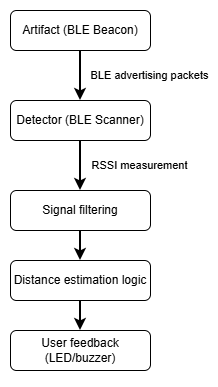
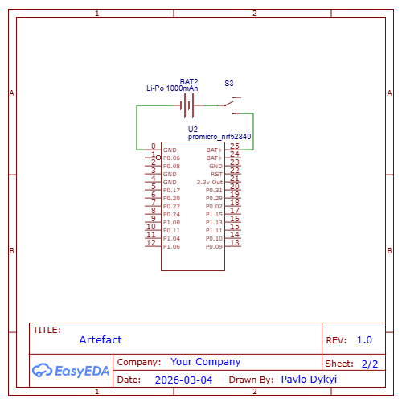
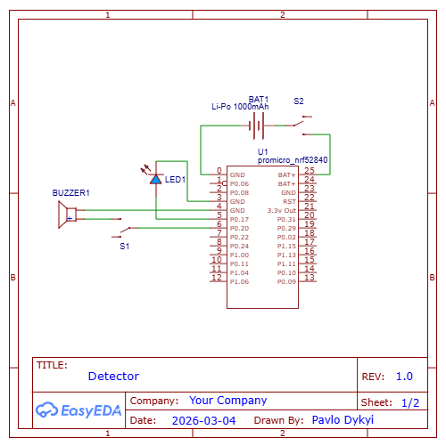

# BLE-Based Proximity Detection System (nRF52840)

## Description

Embedded system consisting of BLE beacon (“artifact”) and portable detector device.
The detector estimates proximity based on RSSI signal strength.
Implemented using nRF52840 (ARM Cortex-M4) and Bluetooth Low Energy communication.

Inspired by proximity detection concept from S.T.A.L.K.E.R. game universe.

## System Architecture

## Hardware

Artifact (Beacon)
- MCU: nRF52840
- BLE advertising mode
- Powered by battery
- Configurable advertising interval

Detector
- MCU: nRF52840
- BLE scanning
- RSSI measurement
- LED / buzzer output

## Firmware Architecture

Firmware structured in modular components:
- BLE module (initialization, advertising/scanning)
- RSSI processing module
- Proximity estimation logic
- Output control module (LED/Buzzer)
- Main loop / event-driven structure

## Distance Estimation Logic

Distance estimation is based on RSSI signal strength using empirical calibration.
Basic filtering applied to reduce noise influence (moving average / simple smoothing).

## What I Learned

- BLE communication fundamentals
- RSSI variability and real-world signal instability
- Modular firmware structuring
- Importance of filtering in noisy environments
- Power vs responsiveness trade-offs
